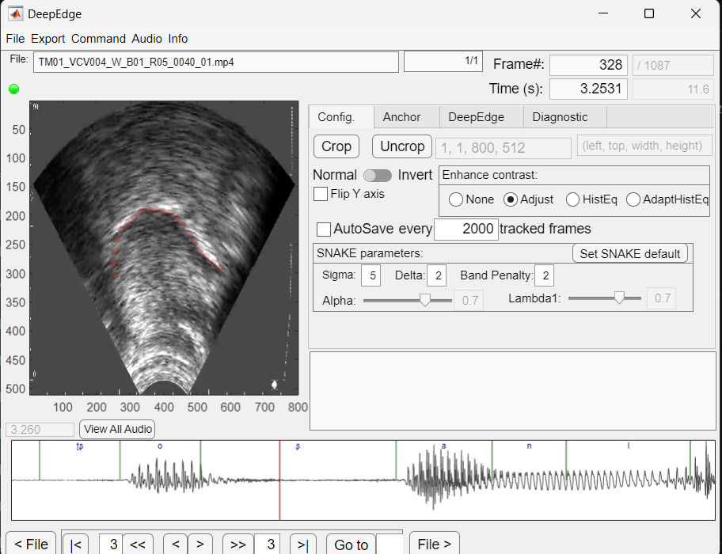
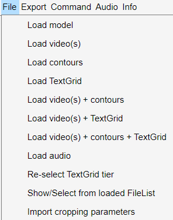
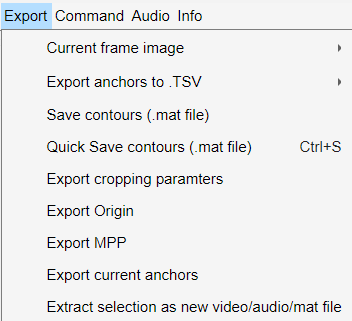
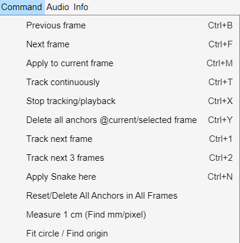
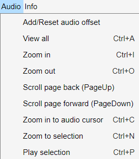
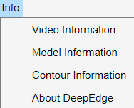
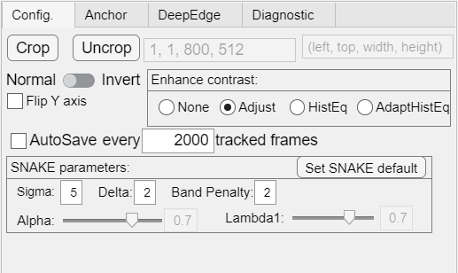
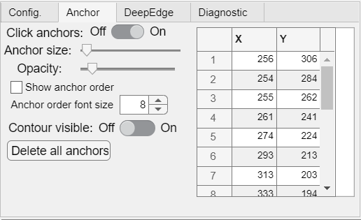
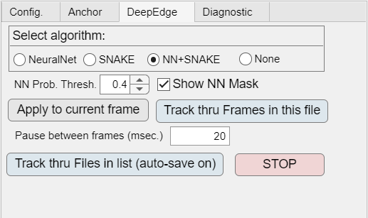
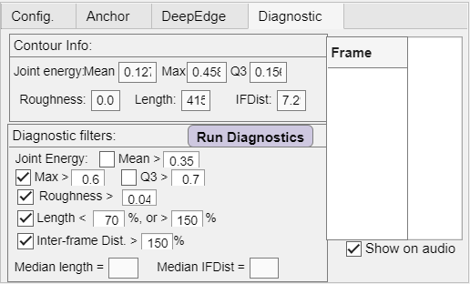

# DeepEdge AI Tool for Ultrasound
DeepEdge AI tool for automatic contour tracing and tracking in ultrasound video

v2.7.7

Latest update: 17DEC2023

https://github.com/WeirongChen/DeepEdge/assets/25228432/d61eb3fe-cca0-411c-b968-f3591938a5dd

- "DeepEdge for Ultrasound" is a MATLAB-based interactive tool for automatic ultrasound tongue contouring, by combining convolutional neural network and SNAKE edge detection methods. DeepEdge uses the pre-trained neural network (U-Net) model to predict the probability of each pixel being covered by the tongue edge, and then SNAKE edge detection refines the neural network predicted tongue edge. 

- The SNAKE algorithm in this program was adopted from [Cathy Laporte's]((https://www.etsmtl.ca/Professeurs/calaporte/Accueil?lang=en-CA)) (Laporte & Ménard, 2018) implementation of the ‘snake’ algorithm in EdgeTrak (Li et al. 2005).

#### For now, to cite DeepEdge:
- Chen, W.-R., Tiede, M., & Whalen, D. H. (2020). DeepEdge: automatic ultrasound tongue contouring combining a deep neural network and an edge detection algorithm. Paper presented at the 12th International Seminar on Speech Production (ISSP 2020). 

------------------------------------------
### INSTALLATION

##### Requirements:
         - MATLAB R2021a or newer
         - Deep Learning Toolbox (MATLAB)
         - Image Processing toolbox (MATLAB)
         - Computer Vision toolbox (MATLAB)
##### Steps:
1. Download all the files from this distribution and put them in a folder. 
  
2. Download one of the U-Net models and put it in the same folder: 
    Choose the model that best matches (machine/probe combination) your setting. 
    
- Try the general purpose model (DpEdge_General...) first. The following general models were trained with 20K+ hand-traced samples across 7 ultrasound machine/probe combinations, covering most common ultrasound systems for tongue imaging.  DpEdg_General_128 was trained with larger (128x128) images; it should provide higher accuracy but runs slower. DpEdg_General_64 was trained with smaller (64x64) images; it runs faster with a slight decrease in accuracy. Howevery, DpEdg_General_64 could be more robust due to using larger pixels in some ultrasound videos.  You can download both and see how them fit to your ultrasound videos:
     - [DpEdg_General_128_25MAR2023](https://yaleedu-my.sharepoint.com/:u:/g/personal/wei-rong_chen_yale_edu/ET_q_t7mYDBJv5uiMP2OSboBZqX7bWd9SsdXdPHBosPcgQ?e=mZwwiK)    
     - [DpEdg_General_64_augm_30MAR2023](https://yaleedu-my.sharepoint.com/:u:/g/personal/wei-rong_chen_yale_edu/ES12JVtJQLlPrmoydtXN_jUBttbG6jZhSyU--B_4cGB90g?e=bFvJrA)    

 - If the general model doesn't work well on your data, you can try other machine-specific models:
      - [DpEdg_Ultrasonix-SonixTouch_C9-5-10_7NOV2019](https://yaleedu-my.sharepoint.com/:u:/g/personal/wei-rong_chen_yale_edu/EXsijdmwl8hDuP1vKsbHdoIB3hXRq5fJNBa80H9BsyK_TA)

      - [DpEdg_Telemed_MC4-2R20S3_128x128_27DEC2022](https://yaleedu-my.sharepoint.com/:u:/g/personal/wei-rong_chen_yale_edu/EVJg8mWLQ1hDhYt5M0arZ4kB60MxpHycADOl4S_1sxmTYQ?e=SxtDb5)
     
3. Download 'make_snake' from Cathy Laporte's [SLURP](https://github.com/cathylaporte/SLURP) repository and put it in the same folder:

     For Windows: [make_snake.mexw64](https://github.com/cathylaporte/SLURP/blob/master/make_snake.mexw64) 

     For MAC: [make_snake.mexmaci64](https://github.com/cathylaporte/SLURP/blob/master/make_snake.mexmaci64)

     For newer MAC:
   If the above mex file for MAC does not work, it could be due to that the MAC OS version is not supported. In this case, try the following alternative mex file for new MAC computers:
   [make_snake.mexmaci64](https://yaleedu-my.sharepoint.com/:u:/g/personal/wei-rong_chen_yale_edu/EUgG4j6b1JxEjW8vg1Io8GkBBJH-bLLHPCpwaq-m_MYRjQ?e=lc717p)
------------------------------------------
### RUN
For example, if the above-mentioned files are put in a folder: ''./DeepEdge'', then:
- In MATLAB command window, type:
     >> cd ./DeepEdge  
     >> DeepEdge  

##### Drop-down menus: 

##### Tab panels: 

##### Usage: 
0. DeepEdge will automatically load the first readable (in alphabetical order) model file in the current folder. 
     - Click "Info" -> "Model information" to check if the model is properly loaded.
     - You can also manually load the model by clicking "File" -> "Load model"
1. Load video:  Click "File" -> "Load video(s)"  
     - You can press "CTRL" or "SHIFT" and then click files to select multiple files. 
     - This will create a file list to be selected in a sequence. 
     - You can click "File" -> "Show/Select from loaded FileList" to select file in the list.
         - (Optional) Load .TextGrid file: Click "File" -> "Load TextGrid"
         - (Optional) Load contours in .mat file: Click "File" -> "Load contours"
2. Crop video: Click "CROP" button in "Config." tab, then click & drag to select the fan-shape area that contains tongue contour. 
3. In the "DeepEdge" tab, select "NeuralNet" or "NN+SNAKE" for whether you want to track using just the neural network model (NeuralNet) or the hybrid method of combining neural network and SNAKE (NN+SNAKE). 
     Select "SNAKE" only: Use the contour in the current frame as the seeds to track the tongue edge in the next frame using SNAKE algorithm.    
4. Click "Apply to current frame" to apply the algorithm on this frame.
     - You can adjust "NN Prob. Thresh" (i.e., contour mask confidence) to best fit your data; 
     - Higher threshold excludes more speckle noises; lower threshold can be used when the contour edge in the image is not clear (including less definite edges). 
5. Click "Track thru Frames in this file" to apply tracking continously on this video file. 
          - You can stop anytime by clicking "Stop tracking"
     - Click "Track thru Files in list (auto-save on)" to apply tracking through all files in the selected file list.
     - When trackign through files, "Auto-Save" will be automatically turned "on": Contours will be automatically saved when the last frame is run through or a preset auto-save frame number is reached (default = 2000). 
6.. Click "Export" -> "Export contours to .MAT file" to save the contours for the currrent video file. 
- Manual contouring:  
  - Left click to add an anchors point of the tongue contour. 
  - Left click and drag to draw a contour. 
  - Right click on the existing anchor points to delete unwanted points.
  - After a contour is manually drawn, you can press "CTRL+N" to apply SNAKE algorithm to snap the anchor points to the closet edge in the image. 
- Zoom in / out/ select range on the audio panel:
  - Left click on the audio panel to select/jump to a frame.
  - Left click and drag on the audio panel to select a range of frames; press "CTRL+N" to zoom to the selected frames on the audio panel. 
  - Zoom in : CTRL + I
  - Zoom out : CTRL + O
  - View All : CTRL + A
  - Play Audio : Select a range of audio on the audio panel, and then press "CTRL + P" to play the audio in the selected range.
  - (These functions can be found in the "Audio" tab of the top menu. 
  - (You may find that these short-cut keys for audio selection/viewing resemble those in PRAAT)
------------------------------------------
------------------------------------------
###
<!--  If you don't have access to MATLAB R2021a, you can download a compiled standalone installer (Windows only):
(You still need to download one of the U-Net models but not 'make_snake')
[DeepEdge standalone Web installer v1.6](https://yaleedu-my.sharepoint.com/:u:/g/personal/wei-rong_chen_yale_edu/EeEVC_R1IKBLmpHzNYtMDC4Bm7v0lqx0HW10wKNQVDKmHA?e=vV5q02)
-->
### 
Known issues:
- Currently MATLAB does not support lossless pixel format yuv444p. If DeepEdge can't read your video file, check if the pixel format of the video file is yuv444p; if it is, re-encode the video file with yuv420p. 

### COPYRIGHT, LICENSE & DISCLAIMER
Copyright (C) 2020 Wei-Rong Chen <wei-rong.chen[AT]yale.edu>  
This program is free software under GNU General Public License, version 3.  
This program is distributed WITHOUT ANY FORM of EXPRESS or IMPLIED WARRANTY and ANY SUPPORT.    
See the GNU General Public License for more details.  

-------------------------------------------
## REFERENCES
- Laporte, C., & Ménard, L. (2018). Multi-hypothesis tracking of the tongue surface in ultrasound video recordings of normal and impaired speech. Medical Image Analysis, 44, 98-114. doi: https://doi.org/10.1016/j.media.2017.12.003
 - Li, M., Kambhamettu, C., & Stone, M. (2005). Automatic contour tracking in ultrasound images. Clinical linguistics & phonetics, 19(6-7), 545-554. doi: 10.1080/02699200500113616
- Chen, W.-R., Tiede, M., Kang, J., Kim, B., & Whalen, D. (2019). An electromagnetic articulography-facilitated deep neural network model of tongue contour detection from ultrasound images. Paper presented at the 178th Meeting of the Acoustical Society of America, San Diego, California. 
- Chen, W.-R., Tiede, M., & Whalen, D. H. (2020). DeepEdge: automatic ultrasound tongue contouring combining a deep neural network and an edge detection algorithm. Paper presented at the 12th International Seminar on Speech Production (ISSP 2020). 
